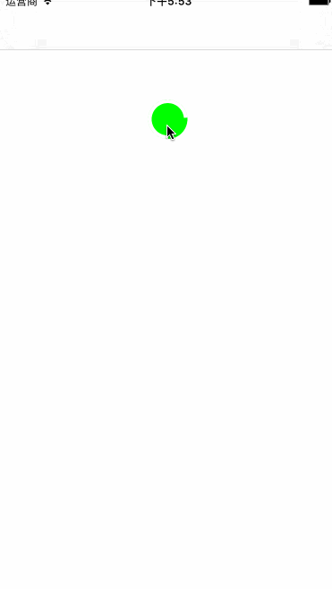

# LoadButton
加载按钮

## 效果图

## 属性

1.按钮是否正在加载    isLoading[BOOL]只读 

2.每次动画运行的时间  duration[NSTimeInterval]  

3.加载框线条的宽度    loadingLineWidth[CGFloat] 

4.加载框线条的颜色    loadingTintColor[UIColor*] 

5.动画开始时的回调    beginBlock[void(^LoadingBegin)(LoadButton*btn)] 

6.动画结束时的回调    endBlock[void(^loadingEnd)(LoadButton*btn)] 

7.加载时是否禁用按钮  disableWhenLoad 

## 方法

1.开始加载   beginLoading 

2.停止加载   endLoading 

3.开始停止加载切换  toggle 

